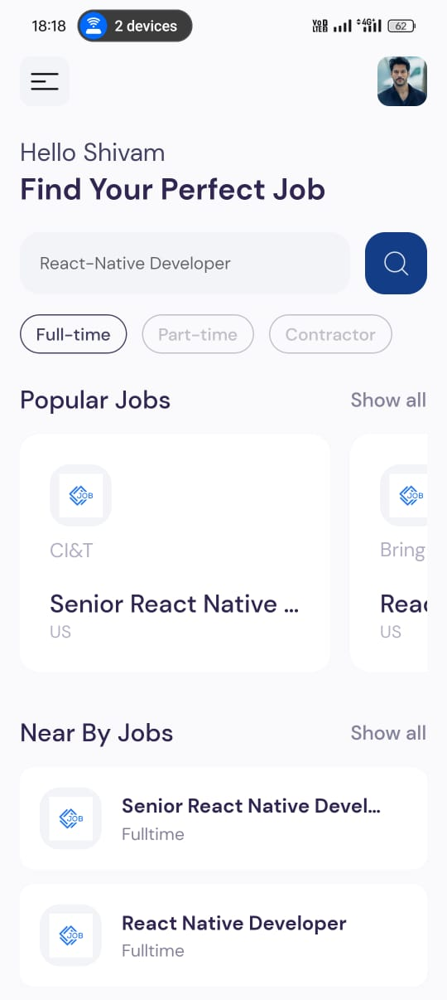
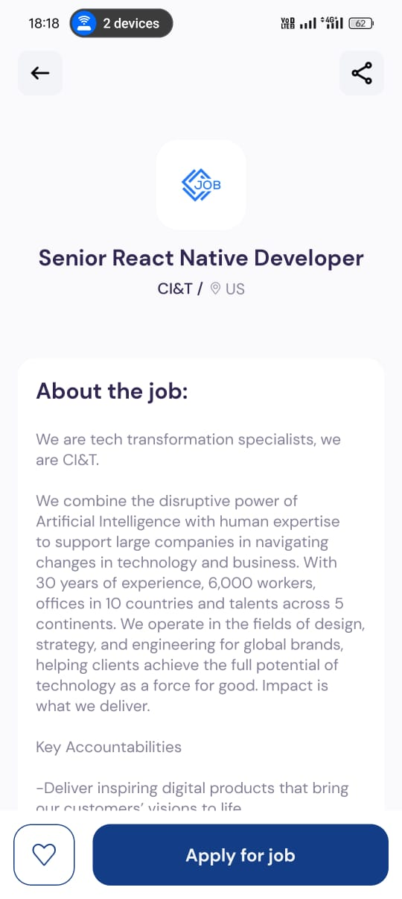
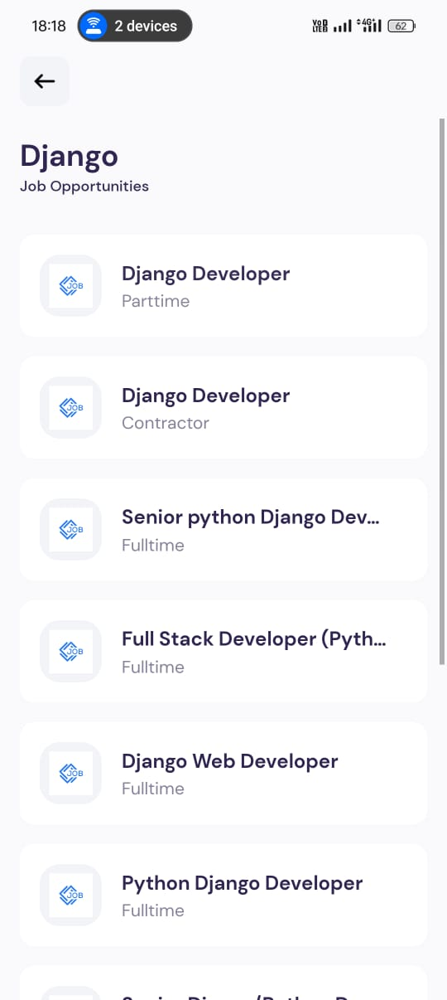

# 🚀 Job Search App

A comprehensive job search mobile application built with **React Native** and **Expo**, designed to simplify the job-hunting process by offering real-time job listings, popular job recommendations, and easy-to-navigate job details.

---

## 📜 Table of Contents

- [🚀 Job Search App](#-job-search-app)
  - [📜 Table of Contents](#-table-of-contents)
  - [📖 About the Project](#-about-the-project)
  - [✨ Features](#-features)
  - [📸 Screenshots](#-screenshots)
  - [🛠️ Technologies Used](#️-technologies-used)
  - [⚙️ Installation](#️-installation)

---

## 📖 About the Project

The **Job Search App** is a mobile application that makes it easier for users to search for jobs across various fields and locations. With a streamlined, modern user interface, it integrates with real-time job APIs to fetch live job listings and ensures users stay updated with the latest job opportunities. 

---

## ✨ Features

- 🔍 **Job Search & Filters**: Search jobs by title, location, or keyword and apply multiple filters to refine results.
- 🌟 **Popular Jobs**: View trending jobs and access detailed job descriptions with a single tap.
- 🎯 **Personalized Recommendations**: Suggests job listings based on user preferences.
- 📱 **Smooth Navigation**: Simple, responsive interface with consistent cross-platform design.
- 📈 **Real-Time Updates**: Displays up-to-date job listings through RESTful API integration.

---

## 📸 Screenshots

<p align="center">
  
  <br>
  <em>🔍 Welcome Screen</em>
</p>

<p align="center">
  
  <br>
  <em>📄 Job Details Screen</em>
</p>
<p align="center">
  
  <br>
  <em>📄 Job Search Result</em>
</p>

---

## 🛠️ Technologies Used

- **Frontend**: ⚛️ React Native, Expo
- **Backend Integration**: 🌐 REST APIs for job data
- **Deployment**: 🚀 Expo Application Services (EAS) for streamlined publishing

---

## ⚙️ Installation

To run the app locally, follow these steps:

1. **Clone the repository**:
   ```bash
   git clone https://github.com/Shivamchaubey14/jobSearch.git


**Navigate to the project directory:**

cd jobSearch

cd jobs

npm install

**Please make sure you added your api key in .env file**

RAPID_API_KEY=YOUR API KEY

**now run npm start scan the qr using expo go to see the results**